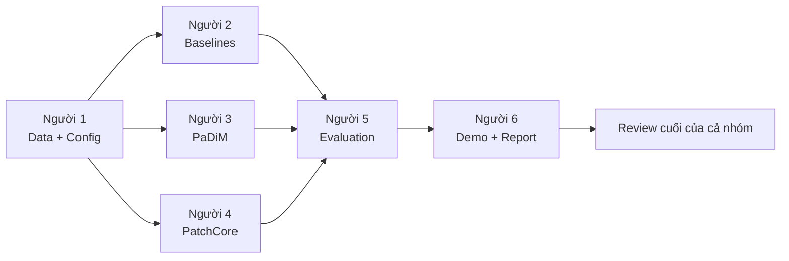

# Industrial Surface Anomaly Detection & Localization

Repository mẫu cho đồ án **phát hiện và định vị bất thường bề mặt sản phẩm công nghiệp bằng Deep Learning** trên MVTec AD.

Mục tiêu của bộ khung này là để 6 thành viên làm việc độc lập theo đúng mảng được giao nhưng vẫn xuất dữ liệu qua một interface chung. Ảnh GitHub tham khảo chỉ được dùng làm mẫu tổ chức thư mục; tên thư mục bên dưới bám theo công việc thực tế của nhóm.

## Nguyên tắc nghiên cứu bắt buộc

- Train chỉ dùng ảnh `good/normal` trong official training set.
- Validation được tách từ normal train bằng seed cố định.
- Official test set và ground-truth mask chỉ dùng cho đánh giá cuối.
- Không chọn threshold hoặc hyperparameter bằng ground-truth test.
- Mọi experiment phải lưu config, seed, metric và đường dẫn artifact để tái lập.

## Cấu trúc repository

```text
.
├── .github/                    # CI, Issue template, Pull Request template
├── configs/                    # Cấu hình experiment dùng chung
├── data/                       # Hướng dẫn dữ liệu; không commit MVTec AD
├── data_protocol/              # Người 1 - Data & Protocol Lead
├── baseline_models/            # Người 2 - Baseline Model Lead
├── padim_model/                # Người 3 - PaDiM Model Lead
├── patchcore_model/            # Người 4 - PatchCore Model Lead
├── evaluation_research/        # Người 5 - Evaluation & Research Lead
├── deployment_report/          # Người 6 - Deployment, Integration & Report Lead
├── shared/                     # Interface và tiện ích dùng chung
├── scripts/                    # Entry point train/fit/evaluate/demo
├── tests/                      # Sanity test và integration test
├── outputs/                    # Chỉ giữ README; artifact lớn không commit
├── docs/                       # Workflow, task board, hướng dẫn setup GitHub
├── .gitignore
├── CODEOWNERS.example
└── CONTRIBUTING.md
```

## Phân công theo workstream

| Người | Workstream | Thư mục chính | Đầu ra bắt buộc |
|---|---|---|---|
| 1 | Data & Protocol Lead | `data_protocol/`, `data/`, `configs/` | Loader, split, transform, seed, data-leakage checks, data API |
| 2 | Baseline Model Lead | `baseline_models/` | Classical CV, Autoencoder, anomaly score/map, checkpoint |
| 3 | PaDiM Model Lead | `padim_model/` | Feature extraction, Gaussian statistics, anomaly score/map |
| 4 | PatchCore Model Lead | `patchcore_model/` | Memory bank, coreset, nearest-neighbor scoring, timing/memory |
| 5 | Evaluation & Research Lead | `evaluation_research/` | Metric, threshold protocol, ablation, error analysis, bảng kết quả |
| 6 | Deployment, Integration & Report Lead | `deployment_report/`, `docs/` | Inference adapter, web demo, README, biểu đồ, báo cáo, slide |

## Luồng tích hợp



Tất cả model phải trả cùng một output contract được mô tả tại [`shared/README.md`](shared/README.md). Không tích hợp bằng file hoặc field tự đặt riêng cho từng model.

## Git workflow ngắn gọn

1. Tạo Issue cho từng task và gán người phụ trách.
2. Tạo branch từ `dev`, ví dụ `feat/patchcore/coreset-sampling`.
3. Commit theo Conventional Commits, ví dụ `feat(patchcore): add coreset sampler`.
4. Push branch và mở Pull Request vào `dev`.
5. Một thành viên trong cặp cross-review duyệt trước khi merge.
6. Cuối mỗi tuần, merge `dev` vào `main` khi CI xanh và Definition of Done đạt.

Cặp cross-review đề xuất: **1 ↔ 4**, **2 ↔ 5**, **3 ↔ 6**. Xem chi tiết tại [`CONTRIBUTING.md`](CONTRIBUTING.md).

## Timeline 4 tuần

| Tuần | Trọng tâm | Gate để được merge vào `main` |
|---|---|---|
| 1 | Data + baseline | Data pipeline chạy được; protocol/metric được khóa; Classical CV và Autoencoder có kết quả sơ bộ |
| 2 | PaDiM + PatchCore | Hai model chạy trên ít nhất 1 category, sau đó mở rộng 3 category; lưu score và anomaly map |
| 3 | Evaluation + ablation | Bảng metric hoàn chỉnh; tối thiểu 3 nhóm ablation; error analysis; chọn model demo |
| 4 | Demo + report | Demo ổn định; README tái lập; chạy lại experiment chính; hoàn thiện báo cáo/slide |

## Bắt đầu

```bash
git clone <repository-url>
cd <repository-name>
git checkout -b dev
git push -u origin dev
```

Sau đó:

- Thay GitHub username trong `CODEOWNERS.example`, rồi copy thành `.github/CODEOWNERS`.
- Bật branch protection cho `main` và `dev` theo [`docs/REPOSITORY_SETUP.md`](docs/REPOSITORY_SETUP.md).
- Tạo các Issue đầu tiên từ [`docs/TASK_BOARD.md`](docs/TASK_BOARD.md).
- Mỗi thành viên đọc README trong thư mục mình phụ trách trước khi viết code.

