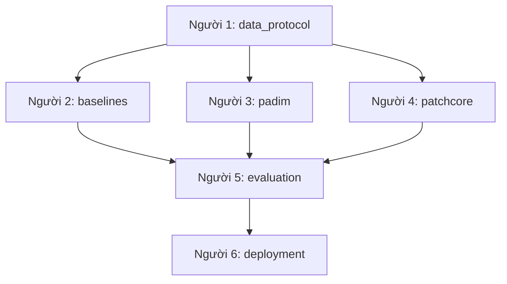

# Workflow phát triển

## Luồng bàn giao



Người 2-4 phải dùng `Sample`, `Prediction`, split manifest và preprocessing do
Người 1 khóa. Người 5 đánh giá mọi model bằng cùng metric/threshold protocol.
Người 6 chỉ tích hợp model đã qua evaluation.

## Git workflow

```text
main       <- bản ổn định
develop    <- nhánh tích hợp của nhóm
feature/*  <- công việc theo issue
```

Branch khởi đầu:

- `feature/p1-data-protocol`
- `feature/p2-baselines`
- `feature/p3-padim`
- `feature/p4-patchcore`
- `feature/p5-evaluation`
- `feature/p6-deployment`

PR đi vào `develop`; cuối mỗi milestone, Leader tạo release PR từ `develop` vào
`main`. Không commit trực tiếp lên `main`.

## Timeline bốn tuần

| Tuần | Trọng tâm | Definition of Done |
|---|---|---|
| 1 | Data + baseline | Contracts, manifest, loader, Classical CV và Autoencoder chạy trên `wood` |
| 2 | PaDiM + PatchCore | Hai model chạy `wood`, sau đó mở rộng ba category; lưu score/map/artifact |
| 3 | Evaluation + ablation | Bảng metric, tối thiểu ba ablation, error analysis và model demo được chọn |
| 4 | Demo + report | Demo ổn định, README tái lập, report/slide và chạy lại experiment chính |

## Nhịp phối hợp

- Đầu tuần: tạo issue, owner, dependency và Definition of Done.
- Giữa tuần: cập nhật blocker và kiểm tra interface.
- Cuối tuần: demo output, cross-review PR và cập nhật milestone.
- Cross-review: `1 ↔ 4`, `2 ↔ 5`, `3 ↔ 6`.

## Trạng thái GitHub Project

`Backlog → Ready → In Progress → Review → Blocked → Done`

Mỗi người tối đa hai issue ở `In Progress`. Issue chỉ được chuyển `Done` khi có
commit/PR, lệnh tái tạo, config/seed và bằng chứng output.

