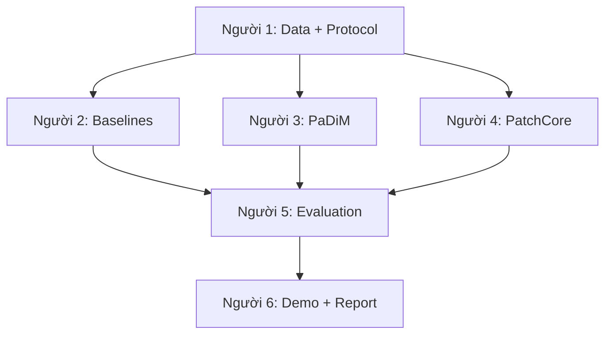

# Workflow nhóm 6 người

## 1. Luồng tích hợp



Người 2-4 không tự chia dataset. Tất cả dùng manifest, loader, transform và config do Người 1 khóa.

## 2. Trách nhiệm

| Người | Module sở hữu | Đầu ra bắt buộc |
|---|---|---|
| 1 - Leader/Data & Protocol | `configs/`, `src/datasets/`, protocol | Loader, split manifest, transforms, seed, kiểm tra leakage |
| 2 - Baseline | Classical CV, Autoencoder | Image score, anomaly map, checkpoint, latency |
| 3 - PaDiM | PaDiM | Feature statistics, score/map, backbone-resolution runs |
| 4 - PatchCore | PatchCore | Memory bank/coreset, score/map, RAM và latency |
| 5 - Evaluation | `src/evaluation/` | Metric dùng chung, threshold audit, ablation, error analysis |
| 6 - Integration/Report | `app/`, visualization, docs | Demo, heatmap/mask/overlay, README, report, slide |

Cross-review bắt buộc: `1 ↔ 4`, `2 ↔ 5`, `3 ↔ 6`.

## 3. Nhịp làm việc hằng tuần

- Thứ Hai: chốt mục tiêu tuần và issue phụ trách.
- Giữa tuần: kiểm tra ngắn blocker, interface và output.
- Cuối tuần: demo phần đã chạy, review PR, cập nhật bảng tiến độ và rủi ro.
- Không báo hoàn thành bằng lời; issue chỉ chuyển Done khi có PR/commit, log chạy và output minh chứng.

## 4. Timeline bốn tuần

### Tuần 1 - Data và baseline

- Người 1 khóa protocol, manifest, loader, transform và seed.
- Người 2 chạy Classical CV và Autoencoder sơ bộ.
- Người 5 khóa schema metric; Người 6 dựng khung demo.
- Definition of Done: loader chạy ba category, test chống leakage qua CI, baseline có output mẫu.

### Tuần 2 - PaDiM và PatchCore

- Chạy end-to-end trên `wood`, sau đó mở rộng `metal_nut` và `capsule`.
- Khóa interface inference.
- Lưu anomaly score/map cùng metadata.
- Definition of Done: PaDiM và PatchCore chạy được tối thiểu một category, artifact có thể nạp lại.

### Tuần 3 - Evaluation và ablation

- Hoàn thiện metric image/pixel-level.
- Tối thiểu ba nhóm ablation trong: backbone, resolution, augmentation, coreset ratio.
- Mỗi model có 3-5 failure case tiêu biểu.
- Definition of Done: bảng so sánh công bằng, chọn model demo có lý do.

### Tuần 4 - Demo và báo cáo

- Freeze model đầu tuần.
- Tích hợp score, label, heatmap, mask, overlay.
- Chạy lại experiment chính từ config sạch.
- Definition of Done: README tái lập, demo ổn định, report/slide và rehearsal Q&A.

## 5. Git workflow

```text
main       <- phiên bản ổn định/bàn giao
develop    <- nhánh tích hợp
feature/*  <- nhánh công việc của từng người
```

Nhánh khởi đầu đề xuất:

```text
feature/p1-data-protocol
feature/p2-baselines
feature/p3-padim
feature/p4-patchcore
feature/p5-evaluation
feature/p6-demo-report
```

Mỗi issue tương ứng một PR nhỏ. PR đi vào `develop`; chỉ Leader tạo PR release từ `develop` sang `main` sau khi CI và review đạt.

## 6. GitHub Project

Columns: `Backlog → Ready → In Progress → Review → Blocked → Done`.

Mỗi issue phải có: owner, tuần/milestone, input, output, Definition of Done, reviewer và dependency. Giới hạn mỗi người tối đa hai issue ở `In Progress`.

